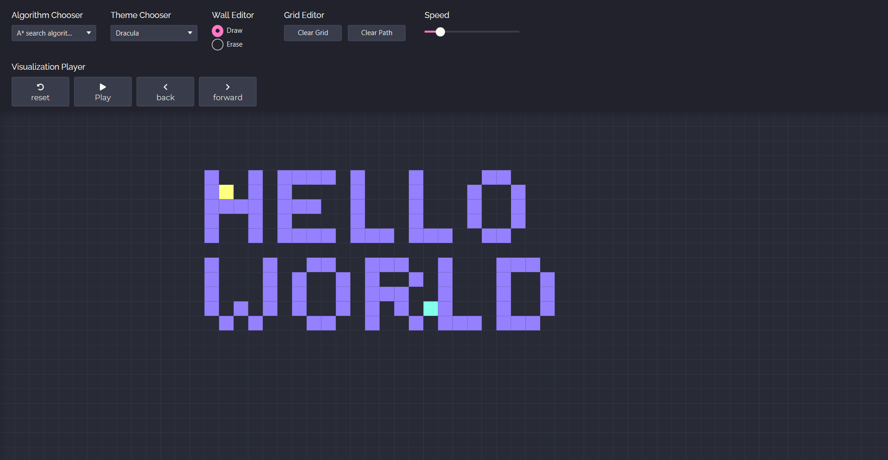
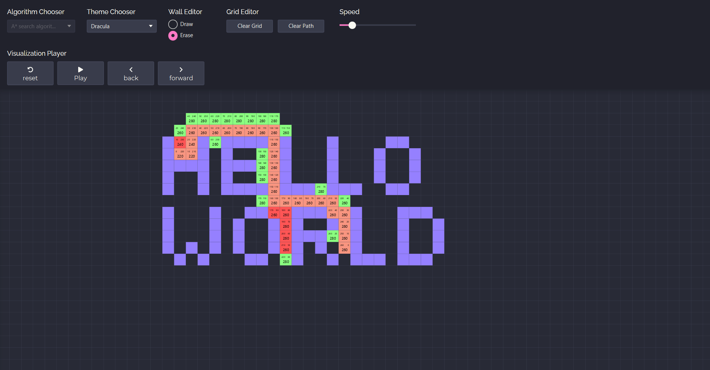

# 🎯 Pathfinding
Pathfinding is a graphical Java application for visualizing several pathfinding algorithms.

### Included Algorithms

- ✅ [A*][A*]: find the shortest path in a weighted graph using an heuristic to guide the process.
- [BFS][BFS]: explore nearest successors first, then widen the search.
- [DFS][DFS]: explore a graph by going as far as possible, then backtrack.
- [Dijkstra][Dijkstra]: find the shortest path in a weighted graph.
- [Edmonds Karp][Edmonds Karp]: find the maximum flow in a weighted graph.
- [Fringe][Fringe]: find the shortest path in a weighted graph using an heuristic to guide the process.
- [IDA*][IDA*]: explore longer and longer paths in a weighted graph at the cost of multiple similar examinations.
- [IDDFS][IDDFS]: explore longer and longer paths in an unweighted graph at the cost of multiple similar examinations.
### Features
- Find the shortest path (not always) between two nodes in the grid.

### Screenshots

[A*]: https://en.wikipedia.org/wiki/A*_search_algorithm
[BFS]: https://en.wikipedia.org/wiki/Breadth-first_search
[Connected components]: https://en.wikipedia.org/wiki/Connected_component_(graph_theory)
[DFS]: https://en.wikipedia.org/wiki/Depth-first_search
[Dijkstra]: https://en.wikipedia.org/wiki/Dijkstra's_algorithm
[Edmonds Karp]: https://en.wikipedia.org/wiki/Edmonds–Karp_algorithm
[Fringe]: https://en.wikipedia.org/wiki/Fringe_search
[Kruskal]: https://en.wikipedia.org/wiki/Kruskal's_algorithm
[IDA*]: https://en.wikipedia.org/wiki/Iterative_deepening_A*
[IDDFS]: https://en.wikipedia.org/wiki/Iterative_deepening_depth-first_search
[Kuhn-Munkres]: https://en.wikipedia.org/wiki/Hungarian_algorithm
[Rust]: https://rust-lang.org/
[Strongly connected components]: https://en.wikipedia.org/wiki/Strongly_connected_component
[Topological sorting]: https://en.wikipedia.org/wiki/Topological_sorting
